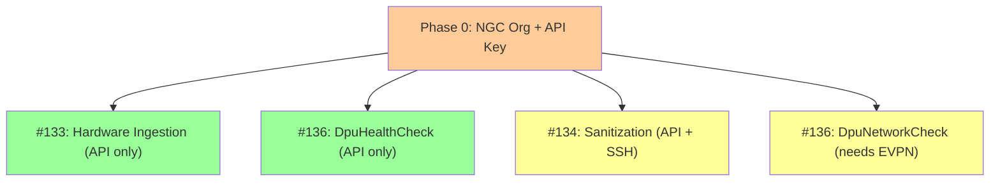

# Feasibility Assessment: MiniCloud Bare Metal Validation Tests

## Overview

Assess readiness and plan implementation for three M4 validation tests that require the PDX MiniCloud/Carbide environment:

- **#133** -- Verify all hardware under test has been ingested and matches provided hardware
- **#134** -- Confirm sanitization on delete (data leakage prevention between tenants)
- **#136** -- Check DPU health and status on instantiation

All three depend on the PDX lab MiniCloud (GB200 NVL nodes managed by NICo/Carbide). The environment handover to ISV Validation Program is targeted for 2026-04-15.

## Problem Frame

The ISV NCP Validation Suite has a mature provider-agnostic framework with AWS as the reference implementation, but **zero Carbide/NICo/MiniCloud integration exists today**. These three issues require:

1. A new Carbide provider implementation (API client, auth, stubs)
2. New validation classes for concepts that don't exist in the current framework (DPU health, disk sanitization, hardware manifest matching)
3. Access to a live MiniCloud environment for development and testing

## Environment Status (as of 2026-04-14)

### PDX MiniCloud Infrastructure

| Component        | Status      | Details                                                       |
| ---------------- | ----------- | ------------------------------------------------------------- |
| Site Controllers | Running     | 3x Dell R760 at 10.184.158.41/43/44, K8s v1.30.4              |
| NICo Core        | Deployed    | Carbide API at VIP .49, Admin UI at .46                       |
| NICo REST        | Deployed    | Cloud API, Temporal, Keycloak, site-agent                     |
| GB200 NVL Tray   | Ingested    | 1 host + 2 BF3 DPUs, chassis serial 1871125000734             |
| EVPN/VXLAN       | In progress | DATA ToR reconfiguration requested for DPU overlay networking |
| BMC Credentials  | Resolved    | Per-machine creds set via carbide-admin-cli                   |
| Shared Access    | Active      | Multiple teams (NVEX, NVIS, TME) using the environment        |

### Access Points

- **Admin UI**: `http://carbide.pdx-lab.local/admin` (add `10.184.158.46 carbide.pdx-lab.local` to `/etc/hosts`)
- **Carbide API**: `https://10.184.158.49:443`
- **Carbide admin CLI**: Available on site controller nodes via `kubectl exec`
- **Slack channels**: #raplap-pdx01-isv-rack (C09NZKN8CQ7), #ncp-isv-lab (C09LL69UB9B)
- **Runbook doc**: [Carbide ISO Installation](https://docs.google.com/document/d/1u3j_VUWs0tbfXLllBC7I_fpscuiJJurAAg3PEuUHb1A)
- **IP assignments**: [PDX Lab IP Sheet](https://docs.google.com/spreadsheets/d/1FpBR74cyx-emBNxAY7JG3PFI9v9H-FvtIDJoXdf9Y9Y)

## Forge Cloud API (Discovered)

Full OpenAPI 3.1.0 spec (v0.2.84) found locally at:
- `ncp-isv-carbide-proxy-service/src/main/resources/docs/openapi/forge_api.yaml`
- `ncp-isv-carbide-proxy-service/docs/openapi/carbide_proxy_api.json` (ISV proxy wrapper)

**Base URL**: `https://api.ngc.nvidia.com/v2/org/{org}/forge/*` (prod) or via ISV proxy at `/v1/carbide/proxy/**`

**Auth**: NGC Bearer token (personal API key or session token from legacy key + OAuth exchange)

### Key Endpoints for These Issues

| Endpoint                                    | Method | Purpose                                                        | Relevant Issue |
| ------------------------------------------- | ------ | -------------------------------------------------------------- | -------------- |
| `/forge/expected-machine`                   | GET    | List pre-registered expected hardware                          | #133           |
| `/forge/machine`                            | GET    | List all discovered/ingested machines                          | #133           |
| `/forge/machine/{id}?includeMetadata=true`  | GET    | Full machine detail (BMC, GPUs, DPUs, NICs)                    | #133, #136     |
| `/forge/machine-capability?type=DPU`        | GET    | DPU capabilities per machine                                   | #136           |
| `/forge/machine/{id}/status-history`        | GET    | Machine state transitions                                      | #136           |
| `/forge/site/{id}?includeMachineStats=true` | GET    | Machine count by status + health                               | #133           |
| `/forge/instance`                           | POST   | Create instance (supports `machineId` for targeted allocation) | #134           |
| `/forge/instance/{id}`                      | GET    | Instance detail (includes `machineId` field)                   | #134           |
| `/forge/instance/{id}`                      | DELETE | Delete instance (triggers sanitization)                        | #134           |
| `/forge/dpu-extension-service`              | GET    | DPU extension services and deployment status                   | #136           |

### Key Schema Fields

**MachineStatus enum**: `Initializing | Ready | Reset | Maintenance | InUse | Error | Decommissioned | Unknown`

**MachineHealth** includes:
- `successes[]`: probe IDs like `DpuDiskUtilizationCheck`, `BgpDaemonEnabled`, `FanSpeed`, `Temperature`, `PowerSupply`
- `alerts[]`: probe IDs like `HeartbeatTimeout` on target `forge-dpu-agent`, `FailedValidationTest` on target `DcgmFullShort`

**MachineMetadata** (provider-only, `includeMetadata=true`):
- `dmiData`: boardSerial, chassisSerial, biosVersion, productSerial
- `bmcInfo`: ip, mac, version, firmwareRevision
- `gpus[]`: name, serial, driverVersion, vbiosVersion, totalMemory, pciBusId
- `networkInterfaces[]`: macAddress, vendor, device, numaNode

**MachineCapability** types: `CPU | Memory | Storage | Network | GPU | InfiniBand | DPU`

**InstanceStatus enum**: `Pending | Provisioning | Configuring | Ready | Updating | Rebooting | Terminating | Error`

**Instance** includes: `machineId` (physical machine assignment), `serialConsoleUrl`, `interfaces[]`, `dpuExtensionServiceDeployments[]`

---

## Issue-by-Issue Feasibility

---

### Issue #133: Hardware Ingestion Verification

**Goal**: Verify all hardware in the rack has been ingested by NICo/Carbide and matches a provided hardware manifest.

**Feasibility: HIGH -- API fully documented, can start immediately**

#### API Surface (Confirmed)

The Forge API provides exactly what we need:

1. **Expected machines**: `GET /forge/expected-machine?siteId={id}` returns pre-registered hardware with `bmcMacAddress`, `chassisSerialNumber`, `fallbackDPUSerialNumbers`, linked `machineId`
2. **Actual machines**: `GET /forge/machine?siteId={id}&includeMetadata=true` returns discovered machines with full hardware detail (BMC info, GPUs, DPUs, network interfaces, serial numbers)
3. **Machine capabilities**: `GET /forge/machine-capability?siteId={id}` returns aggregate capability summary (DPU count, GPU types, storage)
4. **Site stats**: `GET /forge/site/{id}?includeMachineStats=true` returns machine count breakdown by status (Ready, InUse, Error, etc.) and health (healthy/unhealthy)

**Comparison logic**: Match `expected-machine.chassisSerialNumber` to `machine.metadata.dmiData.chassisSerial`. Verify `expected-machine.machineId` is non-null (meaning it was linked to a discovered machine). Check machine status is `Ready` or `InUse`.

#### What's Needed

| Requirement                      | Status                                                                                        | Blocker?                         |
| -------------------------------- | --------------------------------------------------------------------------------------------- | -------------------------------- |
| Forge API endpoint documentation | **RESOLVED** -- full OpenAPI spec available locally                                           | No                               |
| Hardware manifest format         | Use `expected-machine` API as the manifest source -- compare against actual `machine` records | Design decision resolved         |
| Auth mechanism                   | NGC Bearer token (personal API key or session token)                                          | Need NGC API key with org access |
| Network access to Forge API      | Via `api.ngc.nvidia.com` (public) or ISV proxy                                                | No -- public endpoint            |

#### Implementation Shape

- **New stub**: `isvctl/configs/stubs/carbide/hardware_ingestion/verify_ingestion.py`
  - Input: `--org`, `--site-id`, NGC auth via env var
  - Action: `GET /forge/expected-machine` + `GET /forge/machine?includeMetadata=true`, cross-reference by chassis serial
  - Output JSON:
    ```json
    {
      "success": true,
      "platform": "carbide",
      "site_id": "...",
      "expected_count": 4,
      "ingested_count": 4,
      "matched_count": 4,
      "missing": [],
      "extra": [],
      "machines": [
        {
          "chassis_serial": "1871125000734",
          "expected_machine_id": "...",
          "machine_id": "...",
          "status": "Ready",
          "health": "healthy",
          "gpu_count": 4,
          "dpu_count": 2,
          "capabilities": ["GPU", "DPU", "InfiniBand"]
        }
      ]
    }
    ```
- **New validation**: `HardwareIngestionCheck` in `isvtest/src/isvtest/validations/`
  - Check all expected machines are linked to discovered machines
  - Check each machine status is `Ready` or `InUse` (not `Initializing`, `Error`)
  - Check machine health is healthy (no critical alerts)
  - Check DPU and GPU capability counts match expectations
  - Report mismatches as subtests per machine
- **New YAML config**: `isvctl/configs/tests/hardware_ingestion.yaml`

#### Remaining Open Questions

1. **Which NGC org and site ID to use for PDX lab?** Need the org name and site UUID (runbook shows `7ec86730-6c74-4d06-9e01-d9d4571c7197`)
2. **Should the test create expected-machines as part of setup, or assume they already exist?** Recommend: assume pre-registered (setup is an admin/ops task, not a validation test)

---

### Issue #136: DPU Health Check on Instantiation

**Goal**: After a bare metal node is instantiated, verify DPU health and network resource accessibility.

**Feasibility: MEDIUM-HIGH -- API covers most checks, EVPN still needed for network subset**

#### API Surface (Confirmed)

The Forge API provides rich DPU health data without needing direct Redfish access:

1. **Machine health probes**: `GET /forge/machine/{id}` returns `health.successes[]` and `health.alerts[]`
   - DPU-specific probes: `DpuDiskUtilizationCheck` (success), `forge-dpu-agent` heartbeat (alert if timeout)
   - General probes: `BgpDaemonEnabled`, `FanSpeed`, `Temperature`, `PowerSupply`, `Voltage`
2. **DPU capabilities**: `GET /forge/machine-capability?siteId={id}&type=DPU` returns DPU count, device type, vendor
3. **Machine status history**: `GET /forge/machine/{id}/status-history` shows state transitions (Initializing -> Ready)
4. **DPU Extension Service deployment**: On instances, `dpuExtensionServiceDeployments[].status` shows `Pending | Running | Error | Failed | Terminating`
5. **Instance interfaces**: `GET /forge/instance/{id}/interface` shows network interfaces including DPU-attached ones

**No direct Redfish needed** -- Carbide already aggregates DPU health via the `forge-dpu-agent` running on each DPU. The agent reports health probes to the Carbide API.

#### What "DPU Health" Maps To

| Check                          | API Source                                                            | EVPN Required?                |
| ------------------------------ | --------------------------------------------------------------------- | ----------------------------- |
| DPU recognized by Carbide      | `machine-capability?type=DPU` count > 0                               | No                            |
| DPU agent heartbeat            | `machine.health.alerts` -- no `HeartbeatTimeout` on `forge-dpu-agent` | No                            |
| DPU disk utilization           | `machine.health.successes` includes `DpuDiskUtilizationCheck`         | No                            |
| Machine in Ready/InUse state   | `machine.status`                                                      | No                            |
| BGP daemon running on DPU      | `machine.health.successes` includes `BgpDaemonEnabled`                | Partial -- BGP needs underlay |
| DPU extension services running | `instance.dpuExtensionServiceDeployments[].status == Running`         | Yes -- overlay needed         |
| DPU network interfaces UP      | `instance.interfaces[]` status                                        | Yes -- overlay needed         |

#### What's Needed

| Requirement                   | Status                                                                 | Blocker?                                |
| ----------------------------- | ---------------------------------------------------------------------- | --------------------------------------- |
| Forge API documentation       | **RESOLVED**                                                           | No                                      |
| EVPN/VXLAN on DATA ToRs       | In progress                                                            | Blocks network connectivity checks only |
| Instance creation for testing | Need NGC credentials + tenant setup                                    | Soft blocker                            |
| DPU-specific health probe IDs | Partially known from API schema, need to confirm full list on live env | Investigation                           |

#### Implementation Shape

Split into two validation classes to decouple from EVPN:

- **`DpuHealthCheck`** (no EVPN needed):
  - Query `machine-capability?type=DPU` -- verify DPU count matches expected
  - Query `machine.health` -- verify no DPU-related alerts, DPU probes in successes
  - Query `machine.status` -- verify Ready or InUse
  - Query `machine.status-history` -- verify clean state transition (no Error states)

- **`DpuNetworkCheck`** (needs EVPN + active instance):
  - Query `instance.interfaces[]` -- verify DPU-attached interfaces are Ready
  - Query `instance.dpuExtensionServiceDeployments[]` -- verify services Running
  - Query `machine.health` for `BgpDaemonEnabled` probe

#### Remaining Open Questions

1. **What is the full list of DPU-specific health probe IDs?** Need to query a live machine to enumerate
2. **Should this test run against an existing instance, or create its own?** Recommend: accept instance ID as input (test doesn't own lifecycle)
3. **Are there additional DPU health probes beyond what the API schema documents?** The schema shows examples but may not be exhaustive

---

### Issue #134: Sanitization on Delete (Data Leakage Prevention)

**Goal**: Verify that when a bare metal node is deleted and reallocated, no data from the previous tenant is accessible.

**Feasibility: MEDIUM -- targeted allocation API solves the core blocker**

#### Key API Discovery: Targeted Allocation

The `POST /forge/instance` endpoint supports a **`machineId` parameter** for targeted allocation (requires `TargetedInstanceCreation` site capability). Combined with the `GET /forge/instance/{id}` response including `machineId`, this means:

1. Create instance -> get `machineId` from response (know which physical machine)
2. SSH in, write marker data to disks
3. Delete instance (triggers sanitization)
4. Create new instance with **same `machineId`** (targeted allocation) -> guaranteed same physical machine
5. SSH in, search for marker data

**This solves the core feasibility blocker.** We can guarantee the same physical machine on reallocation.

#### Remaining Challenges

1. **`TargetedInstanceCreation` capability**: Must be enabled on the site. This is a provider-level setting.
2. **Sanitization timing**: After `DELETE /forge/instance`, the machine transitions through states. Need to wait for machine to return to `Ready` before creating a new instance on it.
3. **What sanitization actually does**: Need to confirm whether Carbide wipes all user-writable disks or just the OS disk. The `purgeMachines` flag on site delete is a different (nuclear) option.
4. **Shared environment risk**: This test writes to and searches disks. In a shared env, coordinate timing.

#### Possible Approaches (Updated)

**Approach A: Targeted reallocation with disk verification (RECOMMENDED)**
1. Create instance (pool or targeted), note `machineId` from response
2. SSH into instance, write unique marker data (UUID-based) to all NVMe disks
3. Delete instance, wait for machine status to return to `Ready`
4. Create new instance with `machineId` targeting the same physical machine
5. SSH into new instance, search all disks for marker data
6. Pass: no marker data found. Fail: marker data remnants detected.
- **Advantage**: Uses documented tenant API, deterministic, no admin access needed
- **Prerequisite**: `TargetedInstanceCreation` capability enabled

**Approach B: Scout/status verification (lighter weight)**
1. Create instance, write marker data, delete
2. Query `machine.status-history` for sanitization-related state transitions
3. Query `machine.health` for any sanitization probes
- **Advantage**: Doesn't require reallocation
- **Disadvantage**: Doesn't independently verify disk contents
- **Unknown**: Whether Carbide exposes sanitization status in the API

**Approach C: Allocate-all (original John approach)**
1. With small node pool (1 tray), allocate all available machines
2. Write marker data, delete all, reallocate all
3. Since pool is exhausted, reallocation must reuse same physical hardware
- **Advantage**: Works without targeted allocation capability
- **Disadvantage**: Only works with small pools, blocks other users

#### What's Needed

| Requirement                                       | Status                                                                         | Blocker?                                       |
| ------------------------------------------------- | ------------------------------------------------------------------------------ | ---------------------------------------------- |
| `TargetedInstanceCreation` capability on PDX site | Unknown -- need to check                                                       | Blocker for Approach A; Approach C is fallback |
| Instance `machineId` field populated              | Confirmed in API schema                                                        | No                                             |
| Disk enumeration on GB200                         | Need to SSH in and discover NVMe devices                                       | Investigation                                  |
| Sanitization wait time                            | Need to measure how long Carbide takes to sanitize and return machine to Ready | Investigation                                  |
| Multi-tenant setup                                | Tenant API available; need NGC org access                                      | Soft blocker                                   |

#### Remaining Open Questions

1. **Is `TargetedInstanceCreation` enabled on PDX site?** Check via `GET /forge/site/{id}` capabilities
2. **Which disks does Carbide sanitize?** OS disk only, or all NVMe? What about GPU memory?
3. **How long does sanitization take after instance delete?** Need to measure machine state transition time
4. **Does `machine.status-history` show sanitization states?** (e.g., a `Reset` status between `InUse` and `Ready`)
5. **What marker data pattern is most reliable?** Unique UUIDs written to raw block devices vs. filesystem files

---

## Cross-Cutting Requirements

### Carbide Provider Foundation

All three issues require a Carbide provider implementation. The good news: **the API is fully documented** via the OpenAPI spec in `ncp-isv-carbide-proxy-service/`, and validation classes + stubs are already built. Before live testing can begin, we need:

1. **NGC org name + API key with `FORGE_PROVIDER_ADMIN` role** -- the `GET /forge/expected-machine` and `GET /forge/machine` endpoints require provider-level access, not just generic org membership
2. **Provider overlay configs** -- `isvctl/configs/providers/carbide/` YAML files with PDX site-specific settings (org, site UUID)
3. **Extract shared Forge API client** -- `_forge_get` duplicated across stubs; extract to `isvctl/configs/stubs/carbide/common/forge_client.py`

### SSH & Instance Access

Carbide manages SSH access natively -- **no VPN required** for reaching instances:

- **SSH key groups**: `POST /forge/sshkeygroup` + `POST /forge/sshkey` to upload keys. Instance creation accepts `sshKeyGroupIds` to attach keys.
- **Serial console**: Each instance exposes `serialConsoleUrl` (format: `ssh://<id>@<hostname>`), available at VIP .52 port 22. No overlay networking needed.
- **Instance interfaces**: `GET /forge/instance/{id}` returns `interfaces[]` with IP addresses for direct SSH.
- **DPU access from host**: DPU reachable from host OS via tmfifo (`/dev/rshim0/console`) -- no network needed at all.

EVPN overlay is only required for **multi-tenant network isolation** (VPC-style networking), not for basic SSH or DPU health checks from the host.

### Access Requirements (Updated)

| Access Needed | How to Get It | Priority | Status |
| --- | --- | --- | --- |
| NGC org name for PDX lab | Ask John Kenyon | P0 | **Blocked -- message sent** |
| NGC API key with `FORGE_PROVIDER_ADMIN` role | Ask John Kenyon or NGC admin | P0 | **Blocked -- message sent** |
| Forge API network access | Public at `api.ngc.nvidia.com` | -- | **No blocker** |
| SSH to instances | Via Carbide SSH key groups + instance IP, or serial console (VIP .52) | -- | **No blocker -- Carbide-managed** |
| DPU access from host | Via tmfifo from host OS | -- | **No blocker** |
| ~~VPN to PDX lab~~ | ~~Coordinate with raplab team~~ | -- | **Not needed** |
| ~~Carbide REST API docs~~ | ~~Explore from site controller~~ | -- | **Resolved -- OpenAPI spec local** |

## Recommended Sequencing



### Phase 0: NGC Org + API Key (sole P0 blocker)
- Get NGC org name and API key with `FORGE_PROVIDER_ADMIN` role from John Kenyon
- Test a simple `GET /forge/site` call to verify connectivity
- **Message sent to John** -- waiting for response

### Phase 1: #133 + #136 DpuHealthCheck (API-only, run immediately after Phase 0)
- **#133**: Run `verify_ingestion.py` against live Forge API -- validation class + unit tests already built
- **#136 (state)**: Run `check_dpu_health.py` against live Forge API -- validation class + unit tests already built
- Both are read-only API calls, no instance creation, no SSH, no EVPN needed
- Create provider overlay configs with PDX org + site UUID

### Phase 2: #134 Sanitization (API + SSH)
- Implement sanitization stub + validation class (not yet built)
- Requires: `TargetedInstanceCreation` capability (or small-pool workaround)
- SSH via Carbide-managed SSH keys or serial console -- no VPN needed
- DPU accessible from host via tmfifo if needed

### Phase 3: #136 DpuNetworkCheck (after EVPN ready)
- Run `DpuNetworkCheck` validation (interface status, BGP, extension services)
- Requires active instance + EVPN overlay networking for tenant network checks
- **Only check that needs EVPN** -- all other checks work without it

## Implementation Status

**Already built** (as of 2026-04-14):

| Artifact | Path | Status |
|----------|------|--------|
| `HardwareIngestionCheck` validation | `isvtest/src/isvtest/validations/hardware.py` | Done, 8 unit tests passing |
| `DpuHealthCheck` validation | `isvtest/src/isvtest/validations/hardware.py` | Done, 8 unit tests passing |
| `DpuNetworkCheck` validation | `isvtest/src/isvtest/validations/hardware.py` | Done, 8 unit tests passing |
| `verify_ingestion.py` stub | `isvctl/configs/stubs/carbide/hardware_ingestion/` | Done, calls Forge API |
| `check_dpu_health.py` stub | `isvctl/configs/stubs/carbide/dpu/` | Done, calls Forge API |
| `hardware_ingestion.yaml` config | `isvctl/configs/tests/` | Done |
| `dpu_health.yaml` config | `isvctl/configs/tests/` | Done |
| Unit tests | `isvtest/tests/test_hardware.py` | 24 tests passing |
| Pytest markers | `isvtest/pyproject.toml` | Registered: hardware, ingestion, dpu, carbide |

**Remaining work:**

1. **NGC org name + API key with `FORGE_PROVIDER_ADMIN` role** -- sole P0 blocker, message sent to John Kenyon
2. **Provider overlay configs** -- `isvctl/configs/providers/carbide/` YAML files with PDX site-specific settings (org, site UUID) -- can create immediately once org name is known
3. **Live API validation** -- Verify stubs work against real Forge API (pagination, auth, error handling)
4. **#134 sanitization stub + validation class** -- Not yet implemented; waiting for answers on `TargetedInstanceCreation` and disk wipe scope
5. **Extract shared Forge API client** -- `_forge_get` duplicated across stubs; extract to `isvctl/configs/stubs/carbide/common/forge_client.py`
6. **Add pagination support to stubs** -- Current stubs only fetch first page (100 items)

## Risks & Dependencies

| Risk                                               | Impact                              | Mitigation                                                                        |
| -------------------------------------------------- | ----------------------------------- | --------------------------------------------------------------------------------- |
| NGC API key not available                          | All three issues blocked            | P0 -- ask John immediately                                                        |
| `TargetedInstanceCreation` not enabled on PDX site | #134 Approach A blocked             | Fall back to Approach C (allocate-all with small pool)                            |
| EVPN not ready                                     | #136 network checks blocked         | Split into state checks (no EVPN) and network checks (deferred)                   |
| Shared environment contention                      | Tests may conflict with other teams | Coordinate via #ncp-isv-lab; use different timezone windows                       |
| Only 1 GB200 tray ingested                         | Limited coverage                    | Sufficient for initial validation; tests are designed to scale with more hardware |
| Forge API behavior differs from OpenAPI spec       | Stubs may need adjustment           | Build against spec, validate on first live call, adjust                           |
| Environment torn down before testing               | Lose access                         | Tests are provider-agnostic via Forge API -- work on any Carbide deployment       |

## Sources & References

- **Issue #133**: [NVIDIA/ISV-NCP-Validation-Suite#133](https://github.com/NVIDIA/ISV-NCP-Validation-Suite/issues/133)
- **Issue #134**: [NVIDIA/ISV-NCP-Validation-Suite#134](https://github.com/NVIDIA/ISV-NCP-Validation-Suite/issues/134)
- **Issue #136**: [NVIDIA/ISV-NCP-Validation-Suite#136](https://github.com/NVIDIA/ISV-NCP-Validation-Suite/issues/136)
- **Forge API OpenAPI spec**: `ncp-isv-carbide-proxy-service/src/main/resources/docs/openapi/forge_api.yaml` (v0.2.84)
- **ISV Proxy API spec**: `ncp-isv-carbide-proxy-service/docs/openapi/carbide_proxy_api.json` (v1.14.1)
- **NMX Manager API**: `nvmetal/ncx-infra-controller-core/crates/libnmxm/tests/opennmxm.yaml`
- **Runbook**: [Carbide ISO Installation (pdx-lab)](https://docs.google.com/document/d/1u3j_VUWs0tbfXLllBC7I_fpscuiJJurAAg3PEuUHb1A)
- **IP Sheet**: [PDX Lab IP Assignments](https://docs.google.com/spreadsheets/d/1FpBR74cyx-emBNxAY7JG3PFI9v9H-FvtIDJoXdf9Y9Y)
- **BMC reset JIRA**: [NSVH-33799](https://jirasw.nvidia.com/browse/NSVH-33799)
- **Slack**: John Kenyon DM (D0A2TTA6FQE), #raplap-pdx01-isv-rack (C09NZKN8CQ7), #ncp-isv-lab (C09LL69UB9B)
- **Codebase patterns**: `isvctl/configs/tests/bare_metal.yaml`, `isvtest/src/isvtest/core/validation.py`
